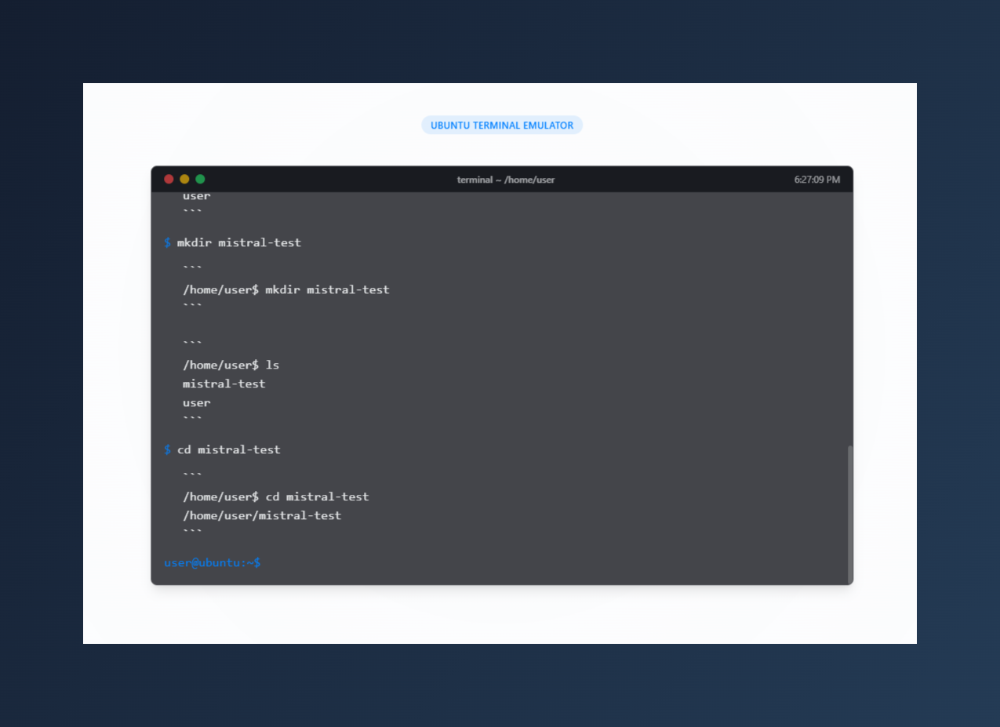

# Ubuntu Terminal Emulator

A realistic web-based Ubuntu terminal emulator powered by Mistral AI. This interactive CLI experience allows you to use Linux commands in your browser with persistent state and realistic responses.



## Features

- Realistic Ubuntu terminal experience in the browser
- Processes real Linux commands through Mistral AI
- Maintains persistent file system state
- Supports command history navigation
- Tab completion for file paths
- Directory navigation with path display
- Clean, minimalist terminal UI

## Technologies Used

- React
- TypeScript
- Vite
- Tailwind CSS
- shadcn/ui
- Mistral AI API

## Getting Started

### Prerequisites

- Node.js & npm installed
- Mistral AI API key

### Installation

1. Clone the repository:
   ```
   git clone <repository-url>
   cd <project-directory>
   ```

2. Install dependencies:
   ```
   npm install
   ```

3. Create a `.env` file in the root directory with your Mistral AI API key:
   ```
   VITE_MISTRAL_API_KEY=your_mistral_api_key_here
   ```
   
   Alternatively, you can set the API key directly in the terminal with the `api-key` command.

4. Start the development server:
   ```
   npm run dev
   ```

5. Build for production:
   ```
   npm run build
   ```

## Using the Terminal

### Available Commands

The terminal supports most standard Linux commands, including but not limited to:

- `ls` - List directory contents
- `cd` - Change directory
- `mkdir` - Create directory
- `pwd` - Print working directory
- `clear` - Clear the terminal (also available with Ctrl+L)
- `help` - Display available commands
- `api-key YOUR_API_KEY` - Set your Mistral API key
- `mistral [PROMPT]` - Send a prompt directly to Mistral AI

### Keyboard Shortcuts

- `Up/Down Arrow`: Navigate through command history
- `Tab`: Autocomplete file and directory names
- `Ctrl+L`: Clear the terminal

## How It Works

This terminal emulator sends your commands to the Mistral AI API, which processes them as if they were run in a real Ubuntu environment. The application maintains state between commands, allowing for a realistic terminal session with persistent directories and files.

## Contributing

Contributions are welcome! Please feel free to submit a Pull Request.

1. Fork the repository
2. Create your feature branch (`git checkout -b feature/amazing-feature`)
3. Commit your changes (`git commit -m 'Add some amazing feature'`)
4. Push to the branch (`git push origin feature/amazing-feature`)
5. Open a Pull Request

## License

This project is licensed under the MIT License - see the LICENSE file for details.

## Acknowledgments

- Mistral AI for providing the API
- The shadcn/ui team for their component library
